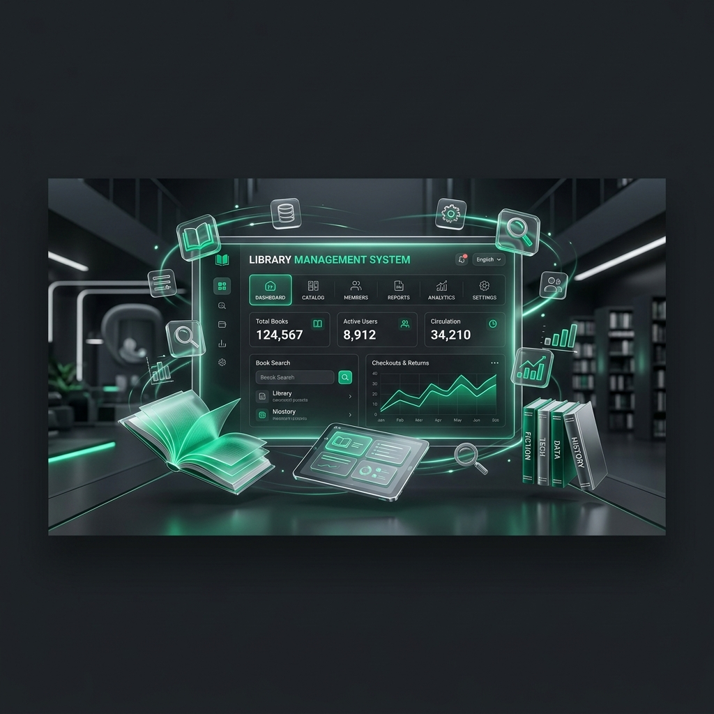
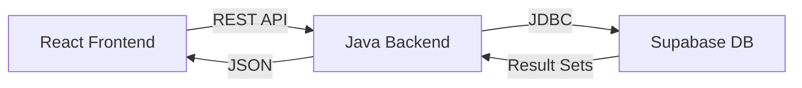

# 📚 Library Management System (LMS Portal)



[](https://openjdk.org/)
[](https://react.dev/)
[](https://supabase.com/)
[](https://vitejs.dev/)

A premium, full-stack Library Management System engineered for high performance and seamless user experience. Designed with a modern **Emerald & Charcoal** aesthetic, this portal automates the entire lifecycle of library operations—from book inventory and member registry to a sophisticated reservation and approval workflow.

---

## ✨ Key Features

### 🚀 Advanced Dashboards
- **Real-time Analytics**: Instant tracking of total books, active issues, overdue returns, and fine collections.
- **Dynamic Stats**: Visual overview of library health with auto-updating metrics.

### 📖 Inventory & Member Management
- **Full CRUD Support**: Manage books and members with high-integrity database constraints.
- **Automated ID Generation**: Unique library IDs (`LIB-XXX`) for every new member.
- **Borrowing Logic**: Strict limits on active issues (Max 5 per member) to ensure fair circulation.

### 🔄 Transaction Engine
- **One-Click Issue/Return**: Streamlined workflow with automatic stock adjustments.
- **Automated Fine Calculation**: Precise tracking of overdue fines based on due dates.
- **CSV Exports**: One-click data portability for books, members, and transactions.

### 🛠️ Reservation System (New!)
- **Member Requests**: Patrons can request books that are currently unavailable.
- **Admin Approval Workflow**: Admins can review, approve, or reject book requests directly from the dashboard.
- **Auto-Issue on Approval**: Approved requests automatically convert into issued transactions.

---

## 🏗️ Technical Architecture

The system utilizes a **Decoupled 3-Tier Architecture** for maximum scalability and performance:

- **Frontend**: React 18 + Vite + Tailwind CSS (State management via React Hooks).
- **Backend**: Pure Java 17 `HttpServer`. Lightweight, lightning-fast, and zero-overhead.
- **Database**: Supabase PostgreSQL. Enterprise-grade reliability with transactional integrity.



---

## 🚀 Quick Start

### 1. Prerequisites
- **Java 17+**
- **Node.js 18+**
- **Maven**
- **Supabase Account**

### 2. Database Setup
1. Execute the `supabase_schema.sql` in your Supabase SQL Editor.
2. Ensure you have the `BookRequests` table for the reservation system.

### 3. Environment Configuration
Create a `.env` file in the root directory:
```env
DB_URL=jdbc:postgresql://your-db-host:5432/postgres
DB_USER=your-username
DB_PASSWORD=your-password
PORT=9090
```

### 4. Launching the Application

#### Backend (Java)
```bash
mvn clean package
java -jar target/library-system-1.0.jar
```

#### Frontend (React)
```bash
cd frontend
npm install
npm run dev
```

---

## 🎨 Design Philosophy
The LMS Portal follows a **Premium Dark Aesthetic**:
- **Primary Colors**: Charcoal (#121212) & Emerald (#10B981).
- **Typography**: Inter / Outfit (Modern Sans-Serif).
- **Interactions**: Smooth micro-animations and glassmorphism effects.

---

## 🛣️ Roadmap
- [x] Core Transaction Engine
- [x] Member & Book CRUD
- [x] Reservation & Approval System
- [x] **Phase 4**: PDF Receipt Generation
- [ ] **Phase 2**: JWT Authentication & Role-Based Access
- [ ] **Phase 3**: Automated Email Reminders


---

Developed with ❤️ by [Amaan Hussain](https://github.com/123AmaanHussain)
