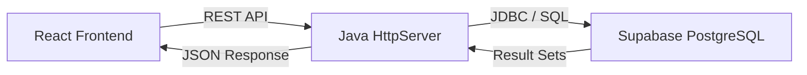

# 📚 Library Book Issue/Return System (Phase-1 Demo)

A modern, full-stack Library Management System designed to automate book inventory, member tracking, and transaction flows. This project is currently in **Phase-1**, focusing on core engine development and database integration.

---

## 🎯 Phase Management (Requirements Check)

| Requirement | Status | Description |
| :--- | :--- | :--- |
| **1. Problem Statement** | ✅ Done | Identified manual bottlenecks and automation goals. |
| **2. Design Models** | ✅ Done | 3-Tier Architecture & Entity-Relationship design. |
| **3. Tech Stack** | ✅ Done | Java 17 + React + Supabase (PostgreSQL). |
| **4. Initial Implementation** | ✅ Done | ~70% core features functional (Target: 30-40%). |
| **5. Database Schema** | ✅ Done | Normalized schema with foreign keys & indexes. |
| **6. Documentation** | ✅ Done | Comprehensive API & Setup guide (Draft). |

---

## 📌 1. Problem Statement
Managing a library manually—using paper logs or unlinked spreadsheets—is inefficient, slow, and prone to "silent" errors. 
*   **Invisibility**: No real-time view of book availability across multiple copies.
*   **Overdue Losses**: Manual fine calculation often results in lost revenue and unreturned books.
*   **Data Silos**: Member records are not dynamically linked to their transaction history.
*   **Solution**: This system provides a centralized digital dashboard that links every book, member, and transaction into a single, automated source of truth.

---

## 🏗️ 2. Design Models & Architecture
The system follows a **Decoupled 3-Tier Architecture**:

### System Flow


### Data Models (Entities)
*   **Book**: Stores title, author, genre, and tracks `total_copies` vs `available`.
*   **Member**: Stores profile data and unique identifier (`LIB-001`).
*   **Transaction**: Manages the lifecycle of a loan (Issued ↔ Due ↔ Returned).

---

## 🛠️ 3. Technology Stack
*   **Backend**: **Java 17** (Pure `HttpServer` for high performance/low overhead).
*   **Core Logic**: **Maven**, **JDBC**, **Google Gson** (JSON Serialization).
*   **Frontend**: **React 18**, **Vite 5**, **Tailwind CSS**, **React Router v6**.
*   **Database**: **Supabase (PostgreSQL)** with Transactional Connection Pooling.

---

## ⚡ 4. Initial Implementation (MVP Progress)
The current build (~70% progress) features a fully functional "Minimum Working Progress" environment:

### ✅ Completed
*   **Dashboard**: Live statistics for total books, active issues, overdue returns, and total fines collected.
*   **Book CRUD**: Full management of the library inventory.
*   **Member Registry**: Registration with automated `LIB-XXX` ID generation.
*   **Transaction Engine**: Core logic for issuing books (stock decrement) and returning books (fine calculation).
*   **Export to CSV**: One-click export of Books, Members, and Transaction data to CSV files.
*   **Borrowing Limit**: Members are restricted to a maximum of 5 active book issues at a time.
*   **Fine Analytics**: Dashboard tracks total fines collected across all returned transactions.

### 🚧 Upcoming (Phase-2)
*   Admin Authentication (JWT Login).
*   PDF Receipt Generation for returns.
*   Email Notifications for overdue members.

---

## 🗄️ 5. Database Schema
The database is structured in PostgreSQL with a focus on data integrity.

*   **`books`**: Master table for all inventory.
*   **`members`**: Stores library patrons with unique email/ID constraints.
*   **`transactions`**: The central ledger for all borrow/return activity.
*   **Indexes**: Implemented on `isbn`, `member_id`, and `due_date` for high-speed queries.

---

## 📖 6. Documentation

### 🚀 Quick Start
1.  **Database**: Run `supabase_schema.sql` in your Supabase SQL Editor.
2.  **Config**: Create a `.env` file in the root with `DB_URL`, `DB_USER`, and `DB_PASSWORD`.
3.  **Run Backend**:
    ```bash
    mvn clean package
    java -jar target\library-system-1.0.jar  # Starts on port 9090
    ```
4.  **Run Frontend**:
    ```bash
    cd frontend && npm install && npm run dev # Starts on port 5173
    ```

### 📡 API Reference
| Method | Endpoint | Description |
| :--- | :--- | :--- |
| `GET` | `/api/dashboard` | Aggregated library statistics |
| `GET` | `/api/books` | Search and list library books |
| `POST` | `/api/transactions/issue` | Issue a book to a member |
| `POST` | `/api/transactions/return`| Process a return & calculate fines |

---

